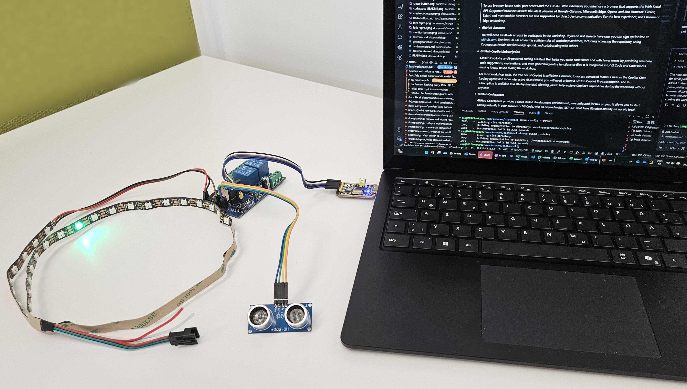

# Welcome to the ESP32 Distance Sensor Project

## 🚗 How This Project Was Born (Or: The Garage Door Incident)

Picture this: You're backing your car into your garage after a long day. You know that sweet spot exists—where your car is fully inside, but you haven't kissed the wall with your bumper. But where is it?

You inch forward... *a little more*... *just a bit further*... **CRUNCH!** 🤦

Or worse: You play it safe, stop too early, and the garage door guillotines your trunk.

Sound familiar? That's exactly how this project started. One frustrated evening, one slightly dented bumper, and one thought: *"There has to be a better way!"*

Enter the ESP32 Distance Sensor: Your garage's new best friend. An ultrasonic sensor measures the distance, and a LED strip lights up to show you exactly where you are. Right now, you'll see a single 🟢 **green LED** moving along the strip as you get closer or further away—simple, effective, and it works!

But here's where it gets fun: **Want color zones?** (🔴 Red for "STOP!", 🟡 Yellow for "careful...", 🟢 Green for "perfect spot"?) That's what the workshop is for! We'll show you how to customize the LED display, add features, and make it your own. Because why solve one problem when you can over-engineer it beautifully? 🎉

---

This project brings together the ESP32, an HC-SR04 ultrasonic sensor, and a WS2812 LED strip to create a fun, interactive distance display. Whether you're here to tinker, learn embedded development, or join our hands-on workshop—you're in the right place!

## 🚀 Get Started

- **Curious?** Jump right in, fire up your codespace and explore the code, hardware, and live demos.
- **New to ESP32?** Check out our [Getting Started Guide](workshop/gettingstartet.md) for step-by-step help.
- **Want to build it yourself?** See the [Hardware Setup](workshop/hardwaresetup.md) and [Workshop Prerequisites](workshop/prerequisites.md).
- **Ready for a challenge?** Try the [Workshop Exercises](workshop/README.md) and level up your skills!

## 💡 Why this project?

- Learn modern embedded development with real hardware
- Use GitHub Codespaces and Copilot for a seamless dev experience
- See your code come to life—literally lighting up!

## 🛠️ Development Resources

### Emulation & Debugging

- **[QEMU Emulator Guide](development/qemu-emulator.md)** - Develop without hardware using full ESP32 emulation
- **[Debugging with GDB](development/debugging.md)** - Step through code with breakpoints in Codespaces
- **[Network Internals](development/qemu-network-internals.md)** - Deep dive into UART-based IP tunnel

### Development Environment

- **[Dev Container Setup](development/devcontainer.md)** - GitHub Codespaces and local Docker setup
- **Getting Started** - Build, flash, and monitor your ESP32

## 🎯 Community & Support

If you get stuck, don't hesitate to ask questions, open an [issue](https://github.com/enthali/esp32-distance/issues), or join the discussion on our [GitHub repository](https://github.com/enthali/esp32-distance). This is a friendly space for makers, learners, and tinkerers of all levels—everyone is welcome!

**Have fun, experiment, and happy coding!** 🎉
