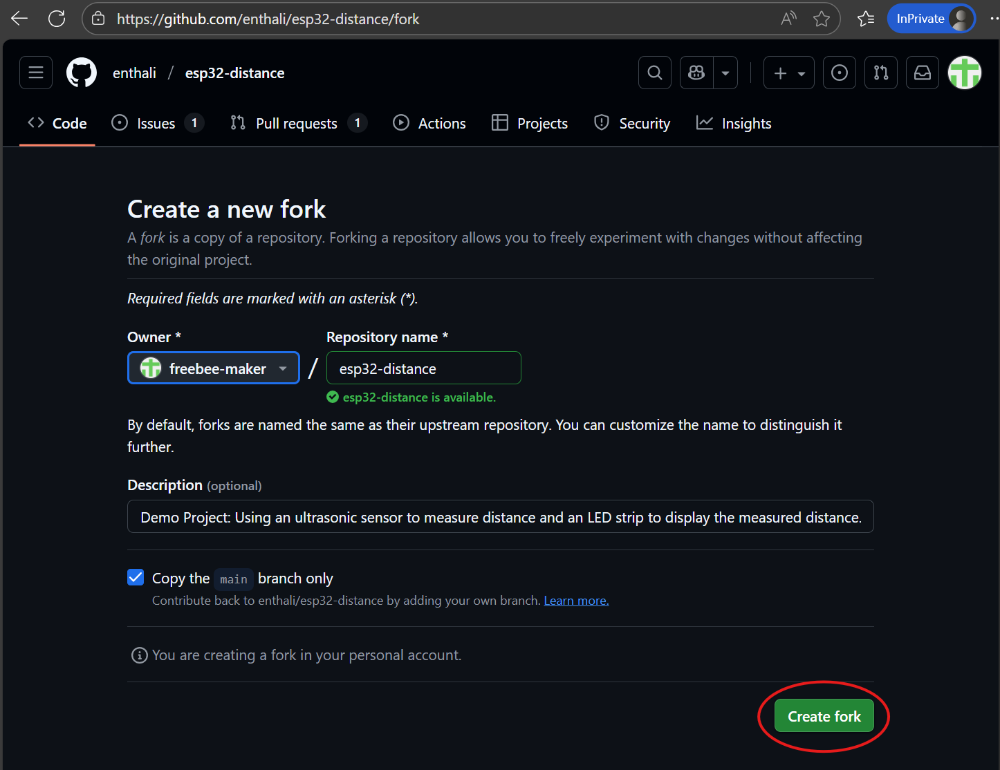
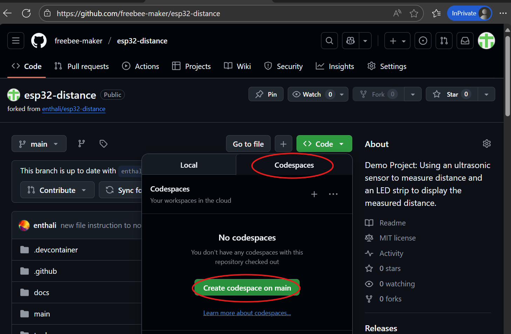
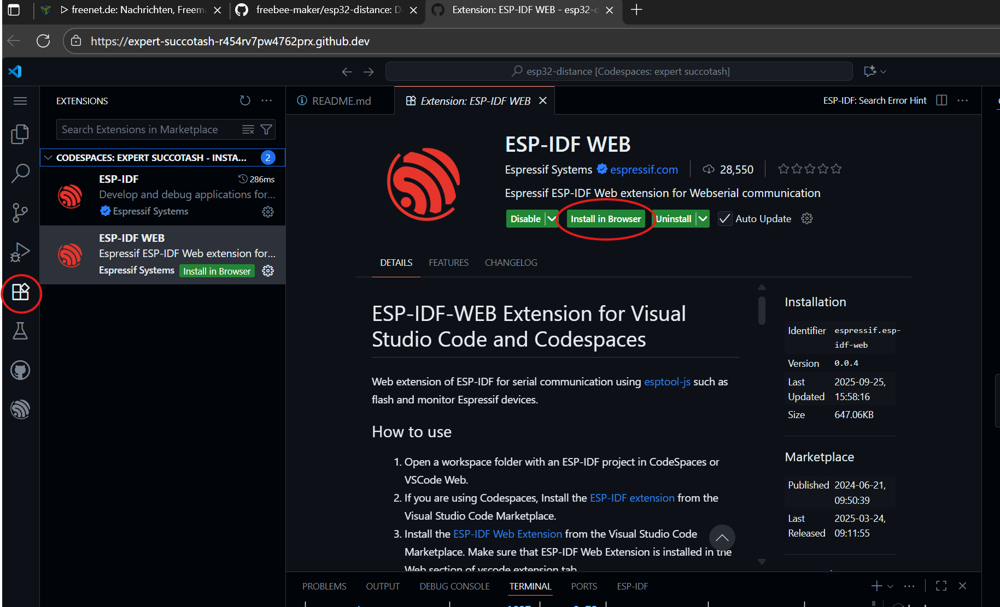
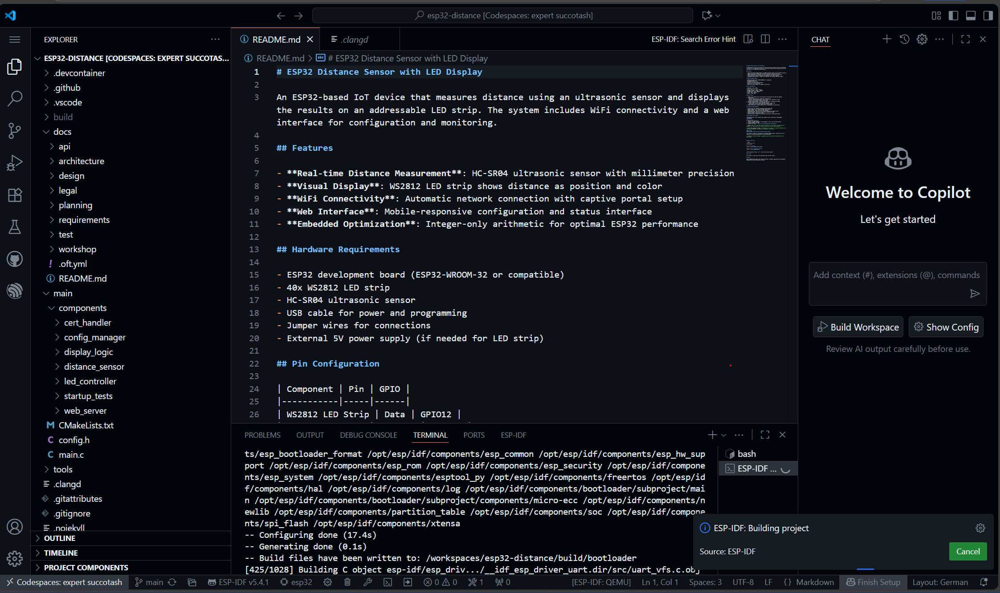
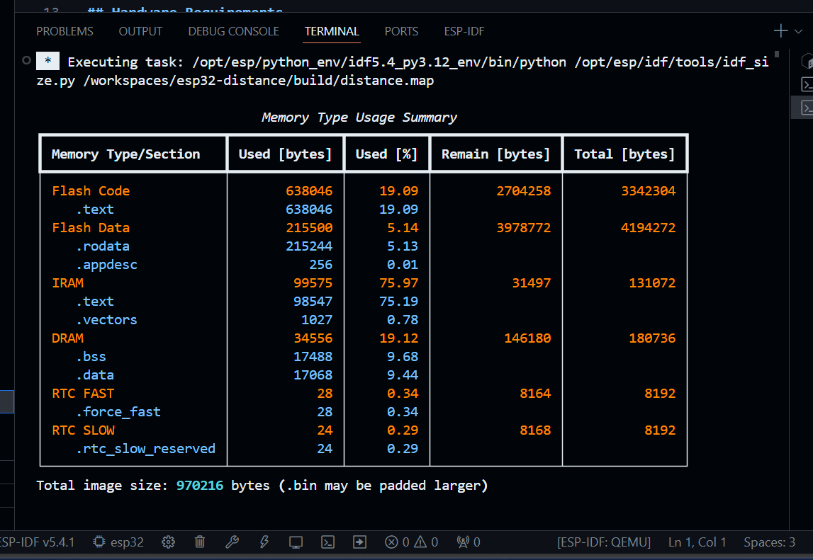
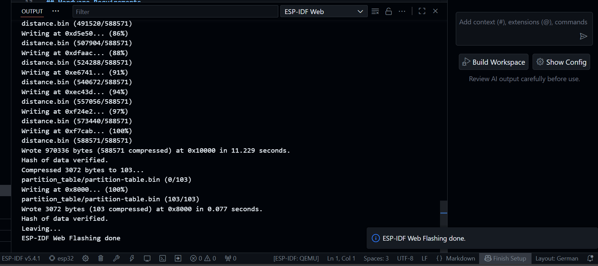

# Getting started

This guide walks you through all steps needed to prepare for the ESP32 Distance Sensor Workshop—from forking the repository to running the system on real hardware. Each step is explained in detail, with screenshots and tips for a smooth start.

> **Hardware Setup:**  
> This guide focuses on software and Codespace setup. For step-by-step instructions on wiring the ESP32, HC-SR04 sensor, and WS2812 LED strip, see [Hardware Setup Guide](hardwaresetup.md).

---

## Fork the repository (one-time)

Start by forking [forking](https://github.com/enthali/esp32-distance/fork) the main repository to your own GitHub account. This gives you a personal copy where you can make changes freely.


[](https://github.com/enthali/esp32-distance/fork)

Press **"Create a new fork"**.  
On the next page, simply press **"Create fork"**.

[](https://github.com/enthali/esp32-distance/fork)

> **Tip:** You only need to fork once. All your workshop work will happen in your fork.

---

## (Optional) Break the link to upstream

By default, your fork knows about the original ("upstream") repository. If you want to avoid accidentally creating pull requests to the upstream project, you can remove the upstream remote. From your terminal simply enter:

```bash
git remote remove upstream
```

You can always re-add it later if you want to sync changes.

---

## Create and open a Codespace from your fork

Before you can open a Codespace, you need to create one in your forked repository. This is a one-time setup (unless you delete your Codespace and need to recreate it).

1. In your forked repository, click the green **"Code"** button.
2. Click on Codespaces
3. Select **"Create codespace on main"**.



> **Note:** The initial Codespace setup can take several minutes (typically around 5 minutes). During this time, all required dependencies—including the full ESP-IDF toolchain, components (about 1GB of data), and the VS Code ESP-IDF extensions—are automatically downloaded and installed for you.  
> Once setup is complete, your Codespace will open in the browser with everything ready to go—no manual installation required. It’s designed to be a true out-of-the-box experience (well, at least it should be 🙂).
>
> **Hint for next time:** You can quickly reopen your Codespace from the GitHub repository page—just click the green **"Code"** button and select your existing Codespace. No need to recreate it each time!

---

## (Optional) Personalize your VS Code environment

Once your Codespace is open, you can customize Visual Studio Code to your preferences:

- **Switch to VS Code for Web:** If you prefer, open your Codespace in the browser using [vscode.dev](https://vscode.dev/) for a lightweight experience.
- **Choose a Theme:** Press <kbd>Ctrl+K</kbd> <kbd>Ctrl+T</kbd> (or open the Command Palette with <kbd>F1</kbd> and type "Color Theme") to select a light or dark theme.
- **Configure Editor Settings:** Adjust font size, tab spacing, or enable line numbers via the gear icon in the lower left or by editing your settings.
- **Install Extensions:** Browse and install recommended extensions (like C/C++, Markdown, or GitHub Copilot) from the Extensions sidebar.

> **Tip:** These settings are saved in your Codespace and will persist for future sessions.

---

## Explore the Codespace interface

Take a moment to get comfortable with the Codespace environment:

- **Left Sidebar Icons:**  
  - **Explorer:** Browse and open project files and folders.
  - **Search:** Find text or symbols across the codebase.
  - **Source Control:** Manage Git version control, view changes, and commit.
  - **Run & Debug:** Launch and debug tasks.
  - **Extensions:** Discover and install VS Code extensions.
  - **GitHub:** Access pull requests and issues.
  - **ESP-IDF Explorer:** Manage ESP32-specific tasks and configurations.

- **Bottom Bar:**  
  - Look for the **Build** icon at the bottom—click it to compile the project. The build process typically takes 1–2 minutes in the Codespace.

> **Tip:** Don’t hesitate to try out the build process now! This will verify your Codespace is set up correctly and help you spot any issues early.

## IMPORTANT !! ⚡ Post-launch: Install ESP-IDF Web Extension

If you don't see the "Flash" and "Monitor" buttons  at the bottom of VS Code, you'll need to install the **ESP-IDF Web** extension for your browser. This extension enables direct serial communication between your Codespace and the ESP32 hardware using your browser's serial port extension.

### Supported Browsers for Serial Port Access

> **Supported Browsers:**  
> The ESP-IDF Web extension and browser-based serial port access are supported in the following browsers:
>
> - **Google Chrome** (v89+)
> - **Microsoft Edge** (v89+)
> - **Opera** (v75+)
> - **Arc Browser**
>
> **Not supported:** Firefox, Safari, and most mobile browsers do **not** support the Web Serial API required for direct device communication.
>
> For the best experience, use the latest version of Chrome or Edge on desktop.

**To install:**

1. Click the **Extensions** icon in the left sidebar.
2. Search for **ESP-IDF Web** the extension should be pre-installed .
3. Click the green **Install in browser** button.



You may be prompted to grant access for the extension to communicate with your device — accept this to enable flashing, monitoring and debugging.

> **Note:** This step is required for browser-based Codespaces to connect, flash, and monitor your ESP32 board.

Once installed, the "Flash" and "Monitor" buttons will appear and you can proceed with programming your device.

---

## Familiarize yourself with the repository

Explore the project structure and key components. Understand where main application logic, components, and documentation are located.



---

## Build the project


Use the "Build" button at the very bottom of the VS Code window. This compiles the firmware using ESP-IDF in the Codespace.

After 1–2 minutes, you should see the build result in the terminal panel at the bottom. Look for a message like **"Build complete"** or **"Project build success"**.



---

## Flash the firmware

After a successful build, connect your ESP Board and reset it to flash mode. (see Hardware setp)


click the "Flash" button (also at the bottom of VS Code). This uploads the firmware to your connected ESP32 board.

### Select serial port

When prompted, you’ll see a message like:

> **`<yourcodespace>.github.dev wants to connect to a serial port`**  
> Select the port of your device and press **Connect**.

Choose the correct serial port for your ESP32 board and confirm. This allows the Codespace to communicate directly with your hardware for flashing and monitoring.


Now, you'll see the flash process in action: the ESP32's onboard flash memory will be erased and the new firmware programmed. Progress is shown in the terminal panel. When complete, you'll see a message like **"ESP-IDF Web: Flashing done."**



---

---

## Monitor the device


Once flashing is complete, click the "Monitor" button (bottom of VS Code) to open a serial monitor. This lets you observe device logs, sensor readings, and debug output in real time.


---

## Experience the running system

With the device running, observe the LED strip responding to distance measurements. Use your phone or laptop to connect to the ESP32's WiFi access point, open the captive portal, and access the web interface. You can experiment with connecting the ESP32 to your own network or adjust range settings via the web UI.

---

## Proceed to Workshop Exercises

After exploring the live system, continue with the workshop exercises (e.g., extending LED patterns, improving distance measurement, testing HTTPS features).

---

## Need Help?

If you get stuck, ask questions, collaborate with others, and make the most of this workshop, the tools and resources provided. Happy coding! 🚀
